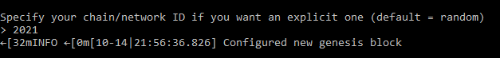
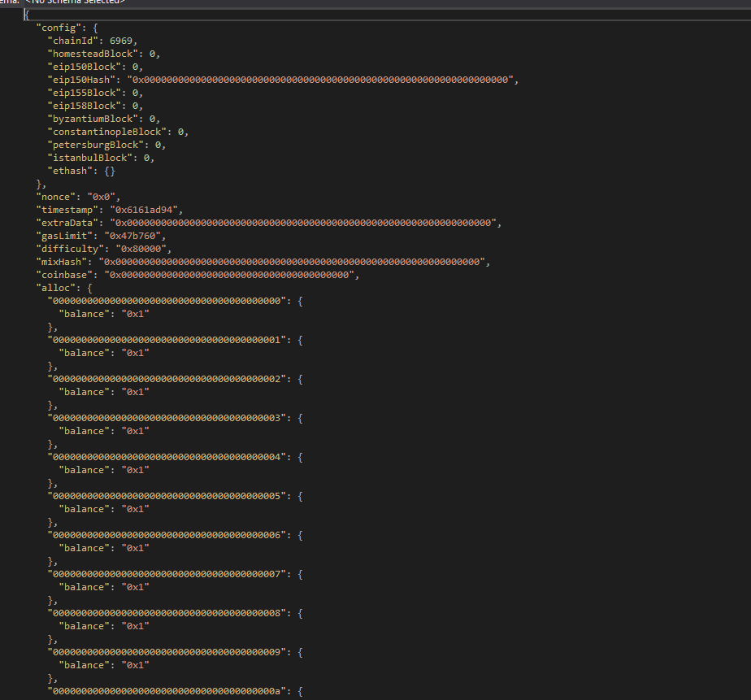
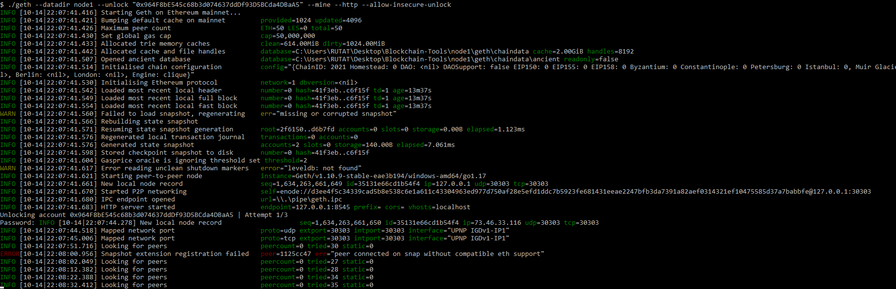
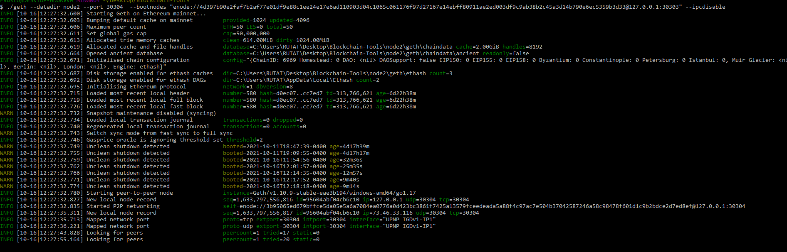
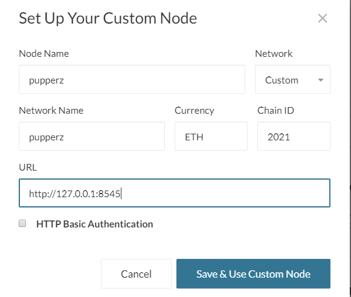
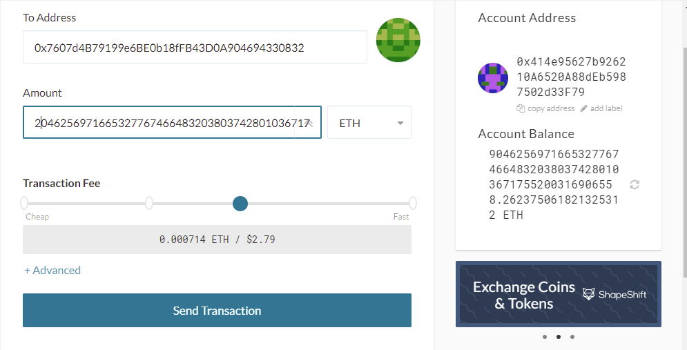
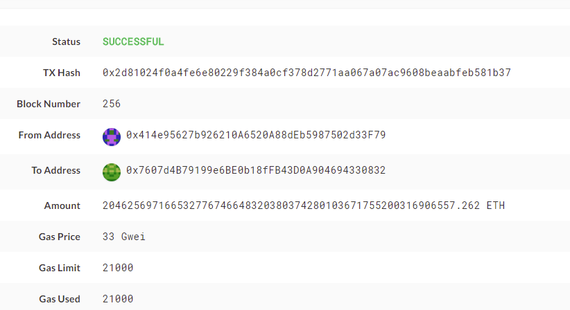
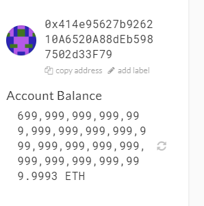
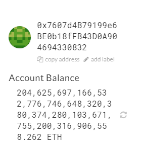

# Network setup
### The 1st step needed to run my block chain is geth once you get that downloaded you can use the files i uploaded as well as this readme to run the block chain. We also need Mycrypto to send transactions and look at our wallets

### I have previously set up the the gensis block using Puppeth and pre loaded the two accounts listed below, you can also see the blocktime, chain ID, account passwords, and ports in the Required information section. Once you have the Blockchain tools downloaded you should dowload my repository and place the nodes as well as the puppeth network within the geth file.

### The next step in this proces is to get node 1 and node 2 running so you can send transactions. To start the first node past this ./geth --rpc.allow-unprotected-txs --http --datadir node1 --mine --miner.threads 1 within your geth folder. This will get node 1 up and running. You can see below what it is supposed to look like 

### After starting node 1 we need to activate node 2 and to do that we need the encode of the 1st node but I have done that for you. All you have to do is open a new gitbash window and paste this within the geth folder ./geth --datadir node2 --port 30304  --bootnodes "enode://4d397b90e2faf7b2af77e01df9e88c1ee24e17e6ad110903d04c1065c061176f97d27167e14ebff80911ae2ed003df9c9ab38b2c45a3d14b790e6ec5359b3d33@127.0.0.1:30303" --ipcdisable. we can see below what that should look like. 

### After setting up both nodes we should then navigate to mycrypto and change network. We then need to add our network by filling out the new node form exactly as I have it because it matches with the files in the repository. using chain Id:6969

### We can then sign into our first wallet using our node 1 keystore file. We then want to copy address 2 from down bellow and then send a transaction between acounts as shown bellow. You can then sign into the other acount by using the node 2 keystore file to see if you received your ehteruem. 

### We can then look at the TXstatus link at the bottom of the screen on my crypto to see the information on our transaction.

### Acounts post 204625697166532776746648320380374280103671755200316905558 ETH transaction

# Required information
### Address 1:  0x414e95627b926210A6520A88dEb5987502d33F79
### path to secret key 1:  node1\keystore\UTC--2021-10-09T15-21-00.866885600Z--026b09614190cdf54c97b40bd8f3e430a53f5b64
### Password: eth123
### Address 2: 0x7607d4B79199e6BE0b18fFB43D0A904694330832 
### Password 2: eth123
### path to secret key 2:  node2\keystore\UTC--2021-10-09T15-22-53.503907300Z--37e099d6e337e8bdd44883cae12af3fa6e678e3e
### ChainID:6969
### ./geth --rpc.allow-unprotected-txs --datadir node1 --unlock "0x964F8bE545c68b3d074637ddDf93D5BCda4DBaA5" --mine --miner.threads 1  --allow-insecure-unlock
### enode://4d397b90e2faf7b2af77e01df9e88c1ee24e17e6ad110903d04c1065c061176f97d27167e14ebff80911ae2ed003df9c9ab38b2c45a3d14b790e6ec5359b3d33@127.0.0.1:30303
### Start node2: ./geth --datadir node2 --port 30304  --bootnodes "enode://4d397b90e2faf7b2af77e01df9e88c1ee24e17e6ad110903d04c1065c061176f97d27167e14ebff80911ae2ed003df9c9ab38b2c45a3d14b790e6ec5359b3d33@127.0.0.1:30303" --ipcdisable
### TX hash: 0x2d81024f0a4fe6e80229f378d2771aa067a07ac9608beaabfeb581b37
